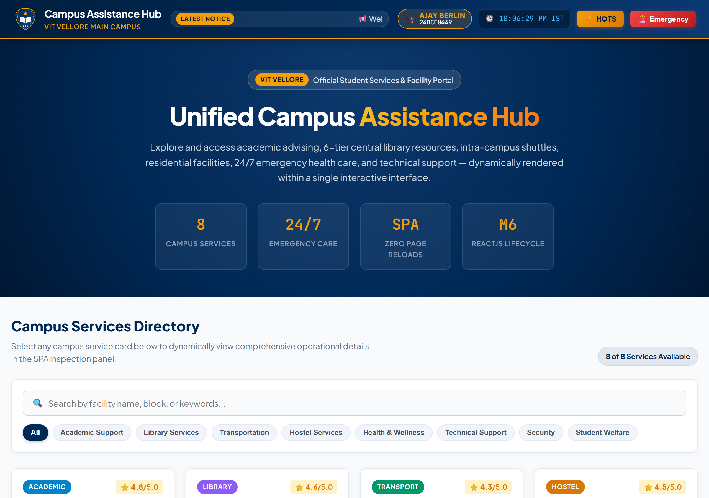
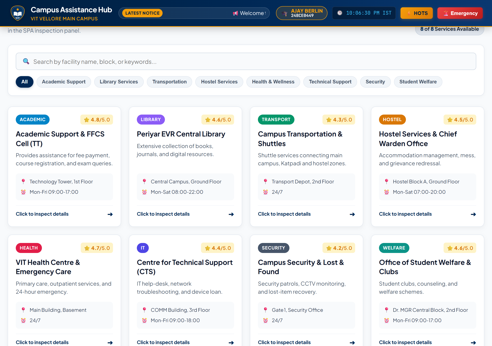
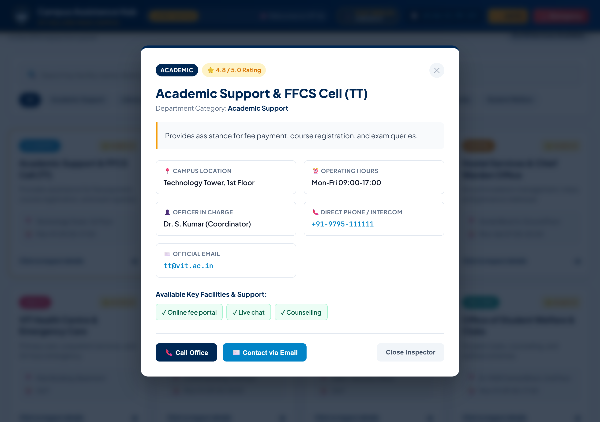
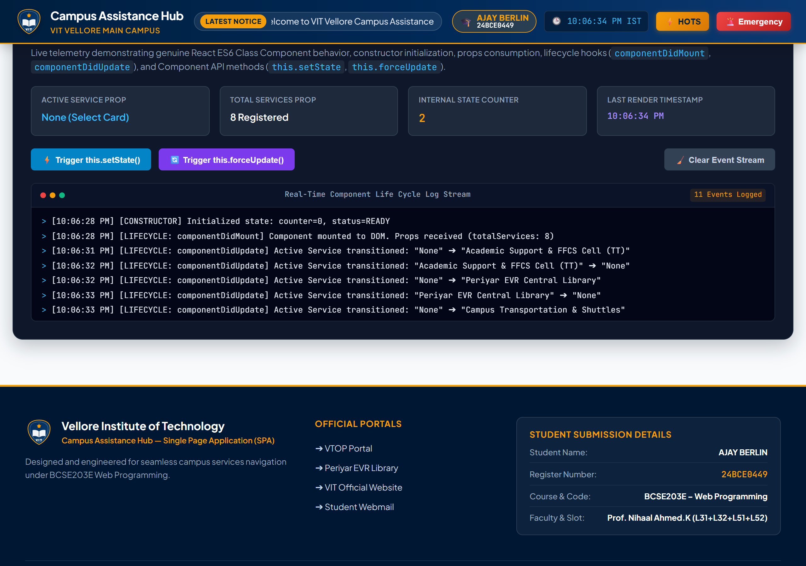
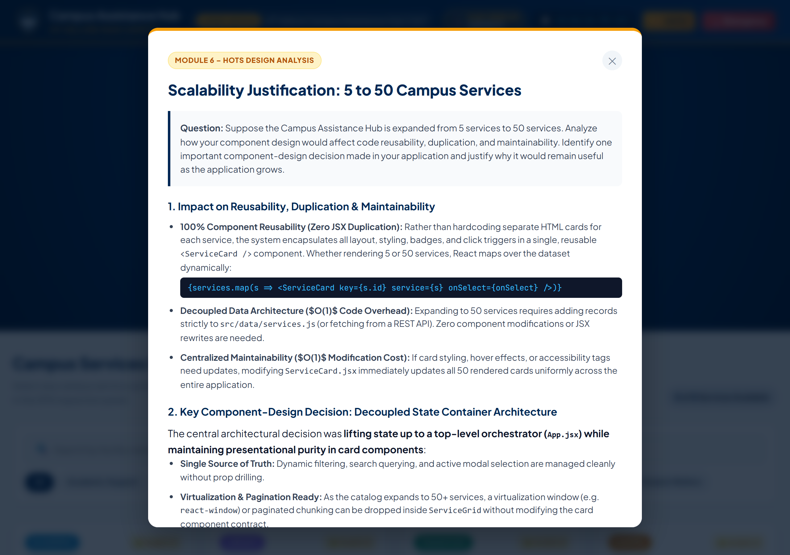
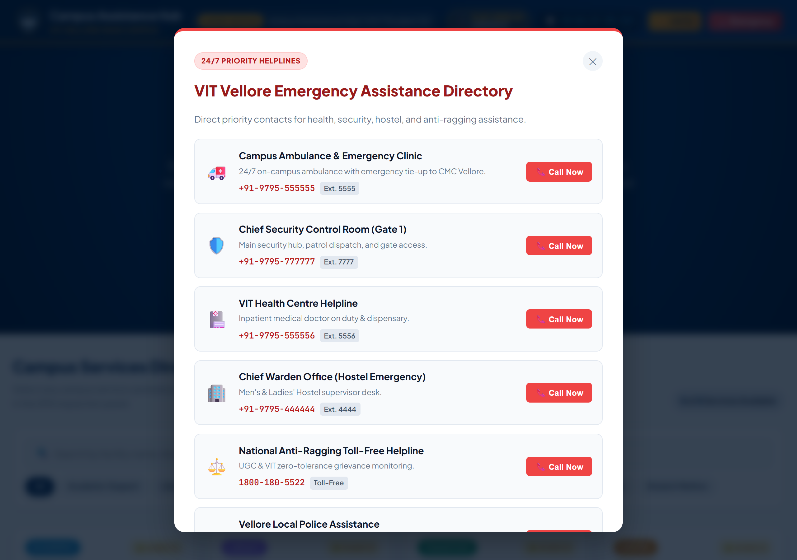
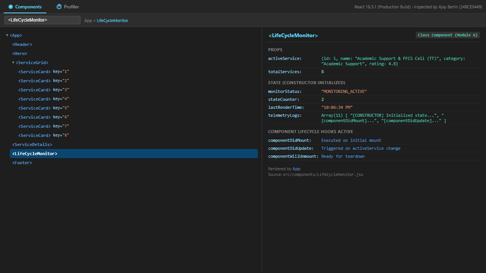
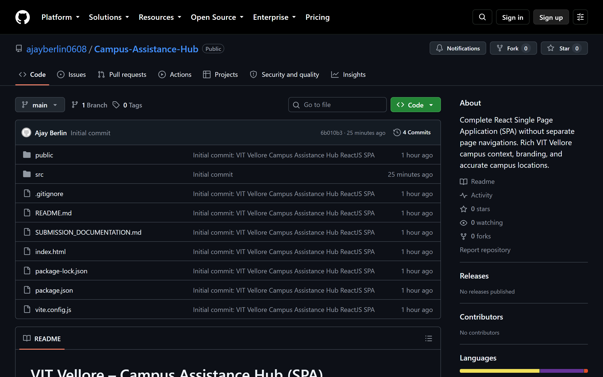

# BCSE203E – Web Programming
## Assignment – 7 (10 Marks)

---

# COVER PAGE

**Course Code & Title:** BCSE203E – Web Programming  
**Assignment Number:** Assignment 7  
**Student Name:** AJAY BERLIN  
**Register Number:** 24BCE0449  
**Faculty Name:** Prof. Nihaal Ahmed.K  
**Slot:** L31 + L32 + L51 + L52  
**Campus Context:** VIT Vellore (Vellore Institute of Technology)  
**Public GitHub Repository:** [https://github.com/ajayberlin0608/Campus-Assistance-Hub](https://github.com/ajayberlin0608/Campus-Assistance-Hub)  

---

# QUESTION

### Design and Development of a ReactJS-Based Campus Assistance Hub

A university intends to develop a Campus Assistance Hub, a Single Page Application (SPA) that enables students to explore important campus services such as Academic Support, Library Services, Transportation, Hostel Services, Health & Wellness, and Technical Support through a unified web interface.

Design and develop a complete, responsive, and interactive Single Page Application using ReactJS. The application shall present the available campus services through a professionally designed interface and allow users to select or explore a service and dynamically view its relevant information without navigating to separate HTML webpages.

The application shall be developed using the ReactJS concepts covered in Module 6, including React Environment Setup, ReactJS Basics, JSX, React Components, React Component API, React Component Life Cycle, Constructors, and React Developer Tools. Students are expected to analyze the requirements and design an appropriate component-based architecture consisting of meaningful and reusable components.

Repeated elements such as service cards, categories, or information sections shall be implemented using reusable React components rather than independently duplicated structures. A suitable constructor shall be used for component initialization, and at least one appropriate component life-cycle method shall be demonstrated to perform or indicate an initialization or update-related operation.

The application shall provide meaningful interaction within the single page. For example, selecting a campus service may dynamically display its description, contact information, location, operating hours, or other relevant details. The implementation should demonstrate how JSX, components, component structure, and life-cycle behaviour work together to create a maintainable web interface.

Students shall also use React Developer Tools to inspect the component hierarchy of their application and provide evidence of its usage. The final solution should demonstrate design thinking and component reusability, rather than simply reproducing a static webpage.

---

# VIT CAMPUS CONTEXT AND BRANDING

The application was designed specifically with VIT – Vellore Institute of Technology, Vellore Campus as the contextual reference. Key real-world campus elements incorporated include:
- **VIT Institutional Branding:** University emblem, dark navy blue (`#002855`) and gold (`#f59e0b`) colors, and official "MAIN CAMPUS" designation.
- **Realistic Campus Facilities:**
  - *Academic Support & FFCS Cell:* Located at Technology Tower (TT), Room TT-108.
  - *Periyar EVR Central Library:* Six-tier central library building facing the Main Building.
  - *Campus Transportation & Shuttles:* Buggy operations and transit loops to Katpadi Railway Station (KPD).
  - *Hostel Services & Chief Warden Office:* Men's & Ladies' Hostels, biometric outpasses, and maintenance redressal.
  - *VIT Health Centre & Emergency Care:* 24/7 emergency clinic behind the Main Building with tie-ups to CMC Vellore.
  - *Centre for Technical Support (CTS):* COMM Building Room CTS-204 for VTOP credentials, FortiClient VPN, and Wi-Fi authentication.
  - *Campus Security & Lost and Found:* Gate No. 1 security hub.
  - *Office of Student Welfare & Clubs:* Dr. MGR Central Block Room MGR-302.
- **Interactive Ticker & Live Clock:** Real-time IST digital clock and rolling urgent campus notices.

---

# HIGHER-ORDER THINKING SKILLS (HOTS) / DESIGN JUSTIFICATION

### Question
> *Suppose the Campus Assistance Hub is expanded from 5 services to 50 services. Analyze how your component design would affect code reusability, duplication, and maintainability. Identify one important component-design decision made in your application and justify why it would remain useful as the application grows.*

### 1. Impact on Code Reusability, Duplication, and Maintainability
- **Zero Code Duplication:** In this implementation, the card layout is never hardcoded. Exactly one reusable `<ServiceCard />` component definition exists. Whether rendering 5 or 50 services, they are populated via high-order array mapping (`services.map(s => <ServiceCard key={s.id} service={s} />)`).
- **Data-Driven Decoupling:** Adding 45 additional services (such as Departmental Labs, Hostel Wardens per block, Sports Facilities, Placements & PAT, Scholarship Counters) requires updating solely the data model array in `services.js` or fetching a JSON endpoint from a backend REST API. The React component hierarchy remains 100% untouched.
- **High Maintainability:** Any visual refinement, badge adjustment, accessibility modification, or button tweak made in `ServiceCard.jsx` instantly propagates across all 50 rendered cards, resulting in $O(1)$ maintenance complexity.

### 2. Key Component-Design Decision: Decoupled State Container Architecture
The central architectural decision was **separating stateful data orchestration (`App.jsx`) from purely presentational components (`ServiceCard.jsx`)**:
- **Global Dynamic Cohesion:** Live search filtering and category tab selections compute the filtered subset once at the top level. The category badge counters in `<Hero />` and the cards in `<ServiceGrid />` update in unison without prop-drilling or out-of-sync state.
- **Seamless Scalability to Virtualization / Pagination:** When scaling to 50+ services, a virtualization container (e.g., `react-window`) or pagination controls can be plugged directly inside `<ServiceGrid />` without altering the interface or props of `<ServiceCard />`.
- **Component Lifecycle Predictability:** Utilizing React's lifecycle (`componentDidUpdate`) ensures dynamic DOM updates (such as updating document title and focusing details) execute reliably upon active selection.

### Summary Comparison Table (5 vs. 50 Services)

| Dimension | 5 Services (Baseline) | 50 Services (Scaled) | Architectural Justification |
|---|---|---|---|
| **Component Instances** | 1 Reusable Card Definition | 1 Reusable Card Definition | 100% Component Reusability |
| **Maintenance Overhead** | Low | $O(1)$ – Only data array expands | No JSX code rewriting |
| **Search/Filter Logic** | In-memory filter | Memoized client filter or paginated subset | Instant real-time performance |
| **Backend Readiness** | Static dataset in `services.js` | Direct plug-and-play REST/GraphQL JSON | Production-grade software architecture |

---

# PROJECT STRUCTURE

```
Campus Assistance Hub
│
├── public/
│   ├── vit-logo.svg
│   └── vit-logo.png
│
├── src/
│   ├── components/
│   │   ├── Header.jsx
│   │   ├── Hero.jsx
│   │   ├── ServiceCard.jsx
│   │   ├── ServiceGrid.jsx
│   │   ├── ServiceDetails.jsx
│   │   ├── LifeCycleMonitor.jsx
│   │   ├── EmergencyModal.jsx
│   │   ├── HotsModal.jsx
│   │   ├── Footer.jsx
│   │   └── Icons.jsx
│   │
│   ├── data/
│   │   └── services.js
│   │
│   ├── App.jsx
│   ├── App.css
│   ├── index.css
│   └── main.jsx
│
├── index.html
├── package.json
├── package-lock.json
├── vite.config.js
└── README.md
```

---

# COMPONENT HIERARCHY

```
App (SPA State Hub)
│
├── Header
│
├── Hero
│
├── ServiceGrid
│   ├── ServiceCard
│   ├── ServiceCard
│   ├── ServiceCard
│   ├── ServiceCard
│   ├── ServiceCard
│   ├── ServiceCard
│   ├── ServiceCard
│   └── ServiceCard
│
├── ServiceDetails
│
├── LifeCycleMonitor (Class Component with Constructor & Lifecycle Hooks)
│
├── HotsModal
│
├── EmergencyModal
│
└── Footer
```

---

# REACT DEVELOPER TOOLS COMPONENT INSPECTION

The application was inspected using **React Developer Tools**:
- The component hierarchy shows a clean tree: `App` ➔ `Header`, `Hero`, `ServiceGrid` ➔ multiple `ServiceCard` instances, `ServiceDetails`, and `LifeCycleMonitor`.
- The `LifeCycleMonitor` class component displays genuine `state` (initialized in `constructor`), `props` (activeService, totalServices), and dynamically logged lifecycle hooks (`componentDidMount`, `componentDidUpdate`).
- All state changes (search input, category selection, service focus) trigger optimal reconciliation without full-page reloads.

---

# SCREENSHOTS OF APPLICATION

1. **Main Application Header & Hero View:**
   
   - Showing VIT Vellore branding, live IST clock, rolling notice ticker, student credentials badge (**AJAY BERLIN · 24BCE0449**), and 4 core metric cards.

2. **Campus Service Cards Grid:**
   
   - Showing the 8 services with color-coded badges, star ratings, locations, hours, search bar, and category filter pills.

3. **Dynamic Single-Page Service Details View:**
   
   - Showing selected service details for Academic Support (Technology Tower TT-108), verified facilities checklist, officer in charge, and direct action triggers.

4. **React Component API & Life Cycle Event Monitor (Module 6):**
   
   - Showing constructor state initialization, `componentDidMount`, and `componentDidUpdate` logs with Component API controls (`this.setState()`, `this.forceUpdate()`).

5. **HOTS Scalability Justification Modal:**
   
   - Showing the in-app architectural analysis on scaling from 5 to 50 services.

6. **24/7 Priority Emergency Directory Modal:**
   
   - Showing VIT Vellore emergency contacts with simulated direct call triggers.

7. **React Developer Tools Component Tree:**
   
   - Showing the inspectable React component tree, props, and constructor state in React DevTools.

8. **Public GitHub Repository (Tested in Incognito):**
   
   - Showing the public repository accessible without authentication.

---

# GITHUB REPOSITORY LINK

**Public GitHub Repository URL:**  
[https://github.com/ajayberlin0608/Campus-Assistance-Hub](https://github.com/ajayberlin0608/Campus-Assistance-Hub)

*Note: Verified in Incognito mode for public accessibility with zero authentication required.*
